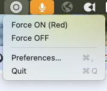
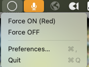

# LuxaforPresence for macOS

Small macOS menu bar app that checks if you are in a meeting and updates [Luxafor flag](https://luxafor.com/product/flag/) - LED free/busy light.

## Why It Exists

Physical “busy lights” only work when they reflect reality. Relying on calendar events or a single integration means the Luxafor flag often stays green even though you jumped into a huddle, picked up an impromptu Teams call, or joined a vendor Zoom from a clean calendar. The reverse also happens: long-running audio tools such as Motiv Mix, Loopback, or stream decks keep the mic interface open and force you to turn the Luxafor flag off by hand. LuxaforPresence exists to remove that manual babysitting.

Real-world presence requires combining multiple cues:

- **Foreground apps** – if Zoom, Teams, Meet, or Slack is frontmost, you are likely in a conversation even if the calendar is empty.
- **Mic/camera state** – CoreAudio, CoreMediaIO, and AVFoundation tell us when audio or video devices are actually in use.
- **Calendar context** (in testing) – meetings on the calendar help catch muted webinars or screen shares where neither mic nor camera is hot.
- **Screen sharing & audio output** (roadmap) – presenting your screen or streaming audio from a conference app is just as strong a signal as talking.
- **Manual overrides** – you can force the Luxafor on/off for edge cases, and the history log captures those overrides for later analysis.

LuxaforPresence runs locally, merges those signals, and pushes the final state to the Luxafor cloud API so your desk flag stays honest without leaking the details of every meeting.

## Project Status

LuxaforPresence is currently in an **alpha** stage: the core heuristic (mic/camera + foreground app) works, however need to expanded "in meeting" signals as described in `PLAN_2.md`. 
Testing and feedback are welcome.

## How Detection Works

1. **Signals collect raw facts**
   - `MicCamSignal` inspects mic and camera devices (with a blocklist for “always-hot” virtual devices on a roadmap) to decide if audio or video is live.
   - `AppSignal` tracks the foreground bundle and checks it against an allowlist of conferencing apps.
   - Upcoming additions such as `CalendarSignal`, `ScreenShareSignal`, and `AudioOutputSignal` are outlined in `PLAN_2.md` and will join the same pipeline.
2. **PresenceEngine scores the signals**
   Each tick, the engine assigns weights to the active signals, debounces flapping states, and decides whether you are “in a meeting.” Manual overrides feed into the same logic so you can temporarily pin the light.
3. **LuxaforTransport updates the flag**
   When the inferred state changes, the transport layer sends the new color to the Luxafor webhook API. All requests are driven from the local machine; no external service stores your history.

See `LuxaforPresence/Model` and `LuxaforPresence/Signals` for the types involved, and `LuxaforPresence/Resources/config.plist` for tunables such as the allowlisted bundles.

## Screenshots

| Light ON (Red) | Light OFF |
| --- | --- |
|  |  |

## Prerequisites

* macOS 13.0 or newer (Apple Silicon or Intel).
* Xcode 14.3+ or Xcode Command Line Tools with Swift 5.7 (`xcode-select --install`).
* A [Luxafor flag](https://luxafor.com/product/flag/) and your Luxafor webhook `userId`.

## Setup

1.  **Clone the repository.**
2.  **Provide Luxafor User ID:**
    *   The `userId` is loaded from a configuration file. You have two options:
    *   **Option 1: (Recommended)** Create a configuration file at `~/.config/LuxaforPresence/config.plist`. The app will create the directory for you. You can copy the bundled config file and edit it.
    *   **Option 2:** Edit the bundled configuration file at `LuxaforPresence/Resources/config.plist` and replace `YOUR_USER_ID_HERE` with your actual Luxafor `userId`. Note that this change will be overwritten if you pull new updates from the repository.
    ```xml
    <!-- ~/.config/LuxaforPresence/config.plist -->
    <?xml version="1.0" encoding="UTF-8"?>
    <!DOCTYPE plist PUBLIC "-//Apple//DTD PLIST 1.0//EN" "http://www.apple.com/DTDs/PropertyList-1.0.dtd">
    <plist version="1.0">
    <dict>
        <key>userId</key>
        <string>YOUR_USER_ID_HERE</string>
    </dict>
    </plist>
    ```
3.  **Assets already included:**  
    The status bar icons (`StatusIconOn/Off/Idle`) ship inside `LuxaforPresence/Resources/Assets.xcassets`; no manual setup is required. If you replace them, keep the same filenames or update `StatusIcon.swift`.

## How to Build and Run

All commands are executed from the repository root and require the Xcode toolchain.

| Action | Command | Notes |
| --- | --- | --- |
| Build (debug) | `swift build` | Produces `.build/debug/LuxaforPresence`. |
| Run (debug) | `swift run` | Launches the menu bar app with sandbox + LSUIElement settings. |
| Run (release) | `swift run -c release` | Good for long manual tests with the physical Luxafor. |
| Run tests | `swift test` | Executes `PresenceEngineTests` and `LuxaforClientTests`. |

If you prefer launching the compiled binary manually, run `.build/debug/LuxaforPresence`; the menu bar icon should appear within a second of launch.

## How to Run Tests

```bash
swift test
```

## Package as a DMG

Use the helper script to build the release binary, wrap it in an `.app`, and produce a disk image you can distribute:

```bash
./scripts/package-dmg.sh
```

The script defaults to the `release` configuration and creates `dist/LuxaforPresence.dmg` containing `LuxaforPresence.app`. Pass `-c debug` to package a debug build or `-n <VolumeName>` to change the mounted volume title. You’ll need the standard macOS tools (`swift`, `hdiutil`, `plutil`) available in your `$PATH`.

## Troubleshooting Mic/Cam Detection

1. Tail diagnostics with `log stream --predicate 'subsystem == "com.example.LuxaforPresence"'`. Each timer tick now prints per-device mic/cam states plus CoreAudio and CoreMediaIO information, for example:
   * `MicCamSignal` logs every `AVCaptureDevice` by localized name and whether `isInUseByAnotherApplication` returned `true`.
   * CoreAudio status lines enumerate the default input plus every running input-capable device so you can see whether HAL reports activity even when AVFoundation does not.
   * CMIO status lines record each camera’s device/UID along with its `DeviceIsRunningSomewhere` flag, which catches cases where Teams/Zoom doesn’t toggle `AVCaptureDevice.isInUseByAnotherApplication`.
2. If you need to verify Luxafor state transitions while debugging mic detection, set `debugAssumeFrontmostImpliesMic` to `true` inside your `config.plist`. When the foreground bundle is allowlisted, `PresenceEngine` will treat the mic/cam signal as active and emit the usual Luxafor updates so the rest of the pipeline can be tested in isolation.
3. See `TRBL_PLAN1.md` for a step-by-step checklist when the mic/cam signal remains `false` despite being in a call.

## How to Install Dependencies

This project uses native macOS frameworks (`AppKit`, `AVFoundation`, `CoreAudio`, `EventKit`) and has no external package dependencies. The Swift Package Manager will handle the project setup.

## License

LuxaforPresence is available under the [Apache License 2.0](LICENSE.txt), which permits commercial use as long as copyright and attribution notices are preserved.
