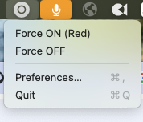
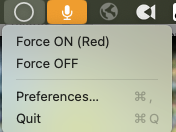

# LuxaforPresence for macOS

macOS menu bar app that updates a [Luxafor flag](https://luxafor.com/product/flag/) based on meeting signals.

## Why It Exists

Calendar-only detection misses ad hoc calls and huddles. Mic-only detection is noisy when other tools keep devices open. This app combines several signals so the light reflects what is happening.

Signals used:

- Meeting app detectors: Zoom, Teams, Webex, Slack Huddles, and Google Meet (process checks, Accessibility UI hints, or browser tab state).
- Mic/camera state from CoreAudio, CoreMediaIO, and AVFoundation.
- Voice activity (VAD) to distinguish active speaking from a silent meeting.
- Calendar context (optional) to catch muted webinars or screen shares.
- Screen sharing and audio output (roadmap).
- Manual overrides for edge cases.

Everything runs locally. The app only sends Luxafor state updates to the Luxafor webhook API.

## Project Status

Alpha. Meeting detectors (Zoom/Webex/Teams/Slack/Google Meet), mic/cam state, and voice activity detection are implemented. Calendar signals are optional via config. Expect changes.

## How Detection Works

1. **Signals collect raw facts**
   - `MeetingDetector` checks Zoom, Webex, Teams, Slack Huddles, and Google Meet.
   - `MicCamSignal` inspects mic and camera devices to see if they are in use.
   - `VoiceActivitySignal` listens for speech (when `vadEnabled` is on).
   - `CalendarSignal` can optionally mark meetings from EventKit (when `useCalendar` is true).
   - `FrontmostAppSignal` only contributes when `debugAssumeFrontmostImpliesMic` is enabled.
2. **PresenceEngine evaluates**
   Each tick, the engine combines detectors, calendar signal, and the optional debug frontmost check. If a meeting is active, voice activity decides between `inMeeting` (red) and `inMeetingSilent` (yellow). Manual overrides can pin the state.
3. **LuxaforTransport updates the flag**
   When the state changes, the transport layer sends the new color to the Luxafor webhook API.

See `LuxaforPresence/Model` and `LuxaforPresence/Signals` for the types involved, and `LuxaforPresence/Resources/config.plist` for tunables such as the allowlisted bundles.

## Screenshots

| Light ON (Red) | Light OFF |
| --- | --- |
|  |  |

## Prerequisites

* macOS 13.0 or newer (Apple Silicon or Intel).
* Xcode 14.3+ or Xcode Command Line Tools with Swift 5.7 (`xcode-select --install`).
* A [Luxafor flag](https://luxafor.com/product/flag/) and Luxafor webhook `userId`.

## Setup

1.  **Clone the repository.**
2.  **Provide Luxafor User ID:**
    *   The `userId` is loaded from a configuration file. You have two options:
    *   **Option 1: (Recommended)** Create a configuration file at `~/.config/LuxaforPresence/config.plist` (or `~/Library/Application Support/LuxaforPresence/config.plist`). The app will create the directory for you. You can copy the bundled config file and edit it.
    *   **Option 2:** Edit the bundled configuration file at `LuxaforPresence/Resources/config.plist` and replace `YOUR_USER_ID_HERE` with your actual Luxafor `userId`. Note that this change will be overwritten if you pull new updates from the repository.
    ```xml
    <!-- ~/.config/LuxaforPresence/config.plist -->
    <?xml version="1.0" encoding="UTF-8"?>
    <!DOCTYPE plist PUBLIC "-//Apple//DTD PLIST 1.0//EN" "http://www.apple.com/DTDs/PropertyList-1.0.dtd">
    <plist version="1.0">
    <dict>
        <key>userId</key>
        <string>YOUR_USER_ID_HERE</string>
    </dict>
    </plist>
    ```
3.  **Assets already included:**  
    The status bar icons (`StatusIconOn/Off/Idle`) ship inside `LuxaforPresence/Resources/Assets.xcassets`; no manual setup is required. If you replace them, keep the same filenames or update `StatusIcon.swift`.
4.  **Optional config knobs:**  
    `enabledMeetingDetectors` lets you limit which app detectors run (Zoom/Webex/Teams/Slack/GoogleMeet). `useCalendar` toggles EventKit checks. `vadEnabled`, `vadThreshold`, and `vadGraceSeconds` tune voice activity detection. `meetingBundles` is only used for the debug frontmost override.

## Permissions

LuxaforPresence relies on macOS privacy permissions to gather signals:

- **Microphone/Camera:** required for mic/cam state and voice activity detection.
- **Accessibility:** required for Teams and Slack meeting UI detection.
- **Automation (Apple Events):** required for Google Meet tab checks in Chrome/Safari.
- **Calendar (optional):** required only when `useCalendar` is true.

## How to Build and Run

All commands are executed from the repository root and require the Xcode toolchain.

| Action | Command | Notes |
| --- | --- | --- |
| Build (debug) | `swift build` | Produces `.build/debug/LuxaforPresence`. |
| Run (debug) | `swift run` | Launches the menu bar app with sandbox + LSUIElement settings. |
| Run (release) | `swift run -c release` | Good for long manual tests with the physical Luxafor. |
| Run tests | `swift test` | Executes `PresenceEngineTests` and `LuxaforClientTests`. |

If you prefer launching the compiled binary manually, run `.build/debug/LuxaforPresence`; the menu bar icon should appear within a second of launch.

## How to Debug

```bash
# run as admin, set 'category' to specific areas, like SlackMeetingDetector or PresenceEngine 
log stream --level debug --predicate 'subsystem == "com.example.LuxaforPresence" && (category == "PresenceEngine" || category == "VoiceActivitySignal")'
```

## Package as a DMG

Use the helper script to build the release binary, wrap it in an `.app`, and produce a disk image you can distribute:

```bash
./scripts/package-dmg.sh
```

The script defaults to the `release` configuration and creates `dist/LuxaforPresence.dmg` containing `LuxaforPresence.app`. Pass `-c debug` to package a debug build or `-n <VolumeName>` to change the mounted volume title. You’ll need the standard macOS tools (`swift`, `hdiutil`, `plutil`) available in your `$PATH`.

## Troubleshooting Detection

1. If Teams or Slack meetings are not detected, confirm Accessibility access is granted to LuxaforPresence (or Terminal/Xcode when running from `swift run`). The app prompts on first launch.
2. If Google Meet is not detected, ensure Chrome or Safari is allowed under System Settings → Privacy & Security → Automation, and that the Meet tab is audible.
3. Tail diagnostics with `log stream --predicate 'subsystem == "com.example.LuxaforPresence"'`. Each timer tick prints per-device mic/cam states plus CoreAudio and CoreMediaIO information, for example:
   * `MicCamSignal` logs every `AVCaptureDevice` by localized name and whether `isInUseByAnotherApplication` returned `true`.
   * CoreAudio status lines enumerate the default input plus every running input-capable device so you can see whether HAL reports activity even when AVFoundation does not.
   * CMIO status lines record each camera’s device/UID along with its `DeviceIsRunningSomewhere` flag, which catches cases where Teams/Zoom doesn’t toggle `AVCaptureDevice.isInUseByAnotherApplication`.
4. If you need to verify Luxafor state transitions while debugging mic detection, set `debugAssumeFrontmostImpliesMic` to `true` inside your `config.plist`. When the foreground bundle is allowlisted, `PresenceEngine` will treat the mic/cam signal as active and emit the usual Luxafor updates so the rest of the pipeline can be tested in isolation.

## How to Install Dependencies

This project uses native macOS frameworks (`AppKit`, `AVFoundation`, `CoreAudio`, `EventKit`) and has no external package dependencies. The Swift Package Manager will handle the project setup.

## License

LuxaforPresence is available under the [Apache License 2.0](LICENSE.txt), which permits commercial use as long as copyright and attribution notices are preserved.
